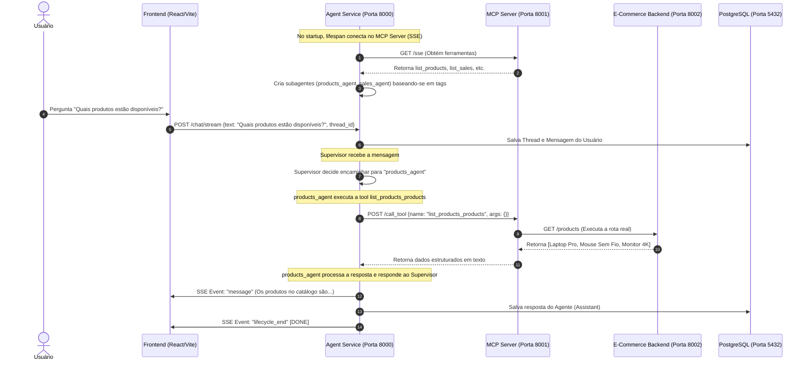

# Arquitetura do Sistema, Multi-Agentes (MCP) e Fluxo de Decisões (HITL)

Este documento detalha o funcionamento interno, as escolhas de design arquitetural, o registro de ferramentas via **Model Context Protocol (MCP)** e o fluxo de dados entre os componentes do ecossistema.

---

## 🗺️ Mapa de Serviços e Portas

O sistema é composto por 4 microsserviços distribuídos localmente:

```
┌────────────────────────────────────────────────────────┐
│                   Frontend (Porta 5173)                │
└───────────────────────────┬────────────────────────────┘
                            │ (POST /chat/stream SSE)
                            ▼
┌────────────────────────────────────────────────────────┐
│            Agent Service (Porta 8000)                  │
│  - Supervisor Agent (LangGraph)                        │
│  - Subagente Produtos | Subagente Vendas               │
└───────────┬───────────────────────────────┬────────────┘
            │                               │
            │ (Carrega Checkpoint/Msg)      │ (Descoberta & Chamada de Tools)
            ▼                               ▼
┌────────────────────────┐      ┌────────────────────────┐
│  PostgreSQL (Porta 5432)│      │   MCP Server (Porta 8001)│
│  - SQLAlchemy Tables   │      │  - FastMCP (from_openapi)
│  - Checkpoint Tables   │      └───────────┬────────────┘
└────────────────────────┘                  │
                                            │ (Redirecionamento de Requests)
                                            ▼
                                ┌────────────────────────┐
                                │   E-Commerce Backend   │
                                │      (Porta 8002)      │
                                │  - API Produtos/Vendas │
                                └────────────────────────┘
```

---

## 🔄 Fluxo de Execução com Subagentes e MCP

Abaixo está o fluxo sequencial detalhado de uma requisição de chat na qual o Agente Supervisor delega tarefas para um subagente dinâmico obtido via MCP:



---

## 1. Arquitetura do Frontend (React)

O frontend foi arquitetado para ser uma SPA reativa baseada no React 19:
* **Custom Hook: `useSSEChat`**: Consome respostas estruturadas de streaming caractere por caractere via `POST /chat/stream` usando a API `fetch` nativa e leitores de stream (`response.body.getReader()`).
* **Painel de Decisões (HITL UI)**: Intercepta eventos `interrupt` do servidor e renderiza uma interface onde o usuário visualiza e pode editar inline argumentos em JSON antes de tomar uma decisão de **Aprovação**, **Rejeição** ou **Resposta**.

---

## 2. Orquestração e Multi-Agentes (Agent Service)

O backend de inteligência é orquestrado de forma descentralizada pelo LangGraph:
* **Supervisor**: Atua como o cérebro centralizador. Ele interage diretamente com o usuário e decide se a solicitação deve ser resolvida por ele mesmo usando ferramentas nativas (ex: e-mail, tempo, arquivos) ou delegada aos subagentes especialistas.
* **Subagentes de Domínio**: São criados de forma dinâmica no startup da aplicação com base nas ferramentas importadas do servidor MCP:
  * **`products_agent`**: Assume todas as ferramentas MCP cujo nome contenha `products`. Especializa-se em catálogo de itens, preços e buscas por ID.
  * **`sales_agent`**: Assume todas as ferramentas MCP cujo nome contenha `sales`. Especializa-se em faturamento, volumes e auditoria de transações.

---

## 3. Servidor de Ferramentas MCP (FastMCP)

O servidor MCP centraliza o acesso ao microsserviço de e-commerce e implementa as seguintes melhores práticas:
* **Zero DRY (from_openapi)**: Não há declaração redundante de parâmetros. O FastMCP lê o schema JSON gerado pelo FastAPI do e-commerce (`http://localhost:8002/openapi.json`) e constrói dinamicamente as assinaturas das ferramentas.
* **Resiliência de Inicialização**: O servidor MCP possui um mecanismo de *polling* que tenta recuperar a documentação via HTTP por até 5 segundos durante a inicialização, utilizando um schema OpenAPI vazio de fallback para evitar que o servidor sofra crash caso o backend do e-commerce ainda não tenha iniciado.

---

## 4. Estrutura de Persistência no PostgreSQL

O banco de dados armazena os dados da aplicação e o estado de concorrência das decisões:
* **Camada SQLAlchemy**: Controla de forma assíncrona (`AsyncSession` + `asyncpg`) as tabelas de threads e mensagens, utilizando `selectinload` para evitar exceções de concorrência e `utc_now_naive()` para compatibilidade de timezones com o driver.
* **Camada LangGraph (AsyncPostgresSaver)**: Utiliza tabelas de persistência nativas para armazenar blobs binários e checkpoints do grafo, permitindo pausar e retomar fluxos complexos exatamente do ponto onde ocorreu a tomada de decisão (HITL).
