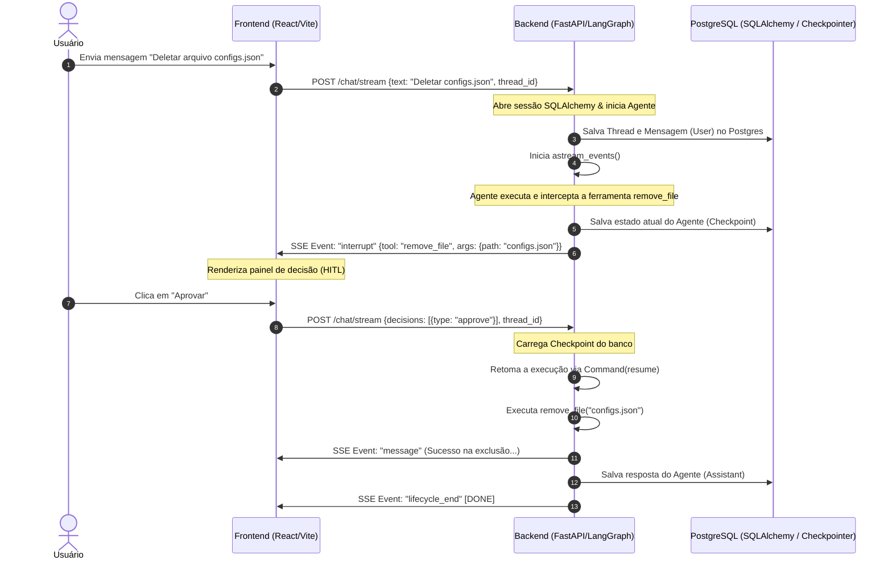

# Arquitetura do Sistema e Fluxo de Decisões (HITL)

Este documento detalha o funcionamento interno, as escolhas de design arquitetural e o fluxo de dados entre o **Frontend** (React), o **Backend** (FastAPI/LangGraph) e o **Banco de Dados** (PostgreSQL).

---

## 🗺️ Fluxo de Dados Global

O sistema opera de forma totalmente orientada a eventos e conexões assíncronas. Abaixo está o fluxo simplificado de uma requisição de chat que engatilha uma tomada de decisão por parte do usuário (Human-in-the-Loop):



---

## 1. Arquitetura do Frontend (React)

O frontend foi arquitetado para ser uma SPA leve, focada em reatividade de fluxo contínuo.

### Custom Hook: `useSSEChat`
A conexão com o endpoint de streaming `/chat/stream` é gerenciada através de um hook personalizado. Devido à necessidade de enviar payloads complexos contendo payloads de decisões (HITL), utilizamos requisições `POST` tradicionais em vez de `EventSource` (que suporta apenas `GET`).
* **Consumo de Streams**: É feito utilizando a API nativa `fetch` lendo o corpo da resposta (`response.body.getReader()`) e decodificando os chunks binários em texto utilizando o `TextDecoder`.
* **Parsing de Eventos**: Os chunks do stream SSE chegam no formato padrão:
  ```text
  event: message
  data: Conteúdo do token
  ```
  O hook separa os eventos (`lifecycle_start`, `message`, `tool_start`, `tool_end`, `interrupt`, `error`, `lifecycle_end`) e atualiza o estado da interface.

### Painel de Decisões (Human-in-the-Loop UI)
Quando um evento do tipo `interrupt` é disparado, a interface renderiza uma caixa de diálogo dedicada contendo:
* **Edição JSON**: O usuário pode visualizar e editar inline os parâmetros que serão enviados para a ferramenta (ex: alterar o caminho do arquivo).
* **Decisões Possíveis**:
  * **Approve (Aprovar)**: Prossegue a execução com os argumentos originais ou editados.
  * **Reject (Rejeitar)**: Cancela a execução. O usuário pode preencher um campo de feedback que é enviado ao agente.
  * **Respond (Responder)**: Envia uma mensagem direta de texto de volta ao agente para orientá-lo sem prosseguir com a ferramenta.

---

## 2. Arquitetura do Backend (FastAPI + LangGraph)

O backend é assíncrono e centrado em threads sem bloqueio do event loop.

### FastAPI Lifespan Manager
A inicialização de conexões e pool com o banco de dados é centralizada no `lifespan`:
1. **psycopg pool**: Inicializa o pool de conexões assíncronas do PostgreSQL.
2. **LangGraph Setup**: Executa o `checkpointer.setup()` para criar as tabelas de checkpoint se não existirem.
3. **Lazy Compilation**: Compila o grafo do Agente (`create_deep_agent`) apenas após o event loop do `asyncio` estar ativo, evitando problemas de inicialização de concorrência.
4. **SQLAlchemy Models**: Sincroniza e cria as tabelas de dados de mensagens de forma assíncrona.

---

## 3. Estrutura de Persistência no PostgreSQL

O banco de dados PostgreSQL é a fonte central de verdade do sistema, dividindo-se em duas camadas lógicas de persistência:

```
                  ┌─────────────────────────────────┐
                  │      Banco de Dados Postgres    │
                  └────────────────┬────────────────┘
                                   │
         ┌─────────────────────────┴─────────────────────────┐
         ▼                                                   ▼
┌──────────────────────────────────┐       ┌──────────────────────────────────┐
│      Mensagens e Histórico       │       │       Checkpoints do Agente      │
│      (SQLAlchemy Async)          │       │      (AsyncPostgresSaver)        │
├──────────────────────────────────┤       ├──────────────────────────────────┤
│ - chat_threads                   │       │ - checkpoint_migrations          │
│ - chat_messages                  │       │ - checkpoints                    │
│                                  │       │ - checkpoint_blobs               │
│                                  │       │ - checkpoint_writes              │
└──────────────────────────────────┘       └──────────────────────────────────┘
```

### Layer A: Persistência de Mensagens da Aplicação (SQLAlchemy)
Gerenciado por modelos ORM síncronos no Python, mapeados para operações assíncronas no banco:
* **`chat_threads`**: Armazena as sessões de conversas (`id`, `user_id`, `title`, `created_at`, `updated_at`).
* **`chat_messages`**: Armazena as mensagens reais enviadas (`id`, `thread_id`, `role`, `content`, `metadata_info`, `created_at`).

> [!IMPORTANT]
> **Compatibilidade Timezone-Naive (asyncpg)**: 
> O driver `asyncpg` exige correspondência exata para colunas do tipo `TIMESTAMP WITHOUT TIME ZONE`. O sistema utiliza o helper `utc_now_naive()` para remover a informação de fuso horário (`tzinfo=None`) das instâncias de data/hora antes da escrita, evitando falhas de serialização.
>
> **Eager Loading (`selectinload`)**: 
> Para evitar erros de carregamento sob demanda (`MissingGreenlet`) em rotas assíncronas do FastAPI, a consulta de listagem de threads carrega ansiosamente as mensagens associadas utilizando a opção `.options(selectinload(models.ChatThreadModel.messages))`.

### Layer B: Memória de Checkpoints do Agente (LangGraph)
Gerenciado nativamente pelo `AsyncPostgresSaver` conectado através do `AsyncConnectionPool`:
* **Como funciona**: O LangGraph serializa todo o estado interno da execução (o histórico interno do modelo, variáveis de estado e o ponto em que o grafo está pausado) e salva nas tabelas `checkpoints` e `checkpoint_blobs`.
* **Retomada de estado**: Quando a requisição envia uma decisão de HITL, o backend busca o estado correspondente usando a chave `configurable: {thread_id}` e retoma a execução exatamente do nó suspenso, sem perder nenhuma variável ou contexto.

---

## 4. Fluxo Detalhado de Tomada de Decisão (HITL)

O ciclo de vida de uma interrupção segue os seguintes passos lógicos:

1. **Definição da Ferramenta**: No arquivo [main.py](file:///mnt/c0b6217c-c2f3-4c1f-8ba2-c8d177f718a9/development/personal/agent-chat-sse-fastapi-01/agent-service/app/main.py), definimos quais ferramentas exigem interrupção:
   ```python
   interrupt_on={
       "remove_file": True, # Pausa e exige decisão com opções (approve/reject/edit)
       "notify_email": {"allowed_decisions": ["approve", "reject"]} # Pausa sem permissão de edição
   }
   ```
2. **Pausa do Agente**: Quando o LLM escolhe chamar a ferramenta `remove_file`, o motor do LangGraph interrompe o processamento logo antes da chamada e salva o checkpoint atual.
3. **Disparo do Evento**: O endpoint `/chat/stream` verifica a interrupção através de `agent.aget_state(config)`. Havendo uma interrupção ativa, dispara um evento SSE `interrupt` contendo a ação que o agente gostaria de realizar e encerra a conexão HTTP de streaming.
4. **Interação do Usuário**: O frontend renderiza o painel e captura a decisão do usuário.
5. **Retomada**: O frontend faz uma nova requisição `POST` contendo as decisões tomadas. O backend carrega o checkpoint da thread do Postgres e injeta a decisão usando:
   ```python
   inputs = Command(resume={"decisions": decisions_list})
   ```
   O agente então executa a ferramenta de acordo com o veredito recebido e finaliza o processamento.
