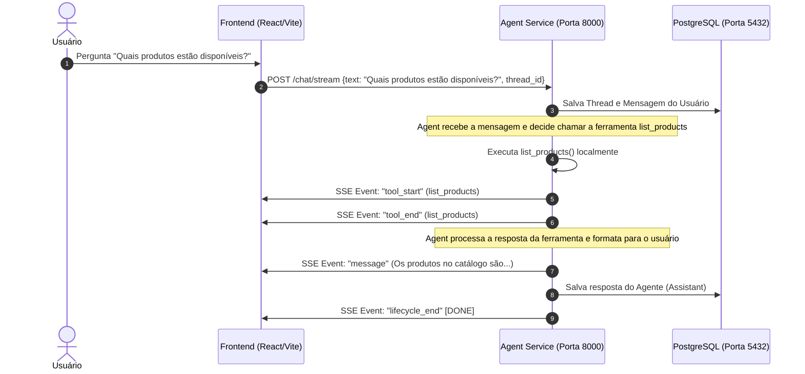

# Arquitetura do Sistema e Fluxo de Decisões (HITL)

Este documento detalha o funcionamento interno, as escolhas de design arquitetural, a definição de ferramentas locais e o fluxo de dados entre os componentes do ecossistema.

---

## 🗺️ Mapa de Serviços e Portas

O sistema é composto por 3 componentes principais distribuídos localmente:

```
┌────────────────────────────────────────────────────────┐
│                   Frontend (Porta 5173)                │
└───────────────────────────┬────────────────────────────┘
                            │ (POST /chat/stream SSE)
                            ▼
┌────────────────────────────────────────────────────────┐
│            Agent Service (Porta 8000)                  │
│  - Supervisor Agent (LangGraph)                        │
│  - Ferramentas locais (tempo, produtos, vendas, etc.)  │
└───────────┬────────────────────────────────────────────┘
            │
            │ (Carrega Checkpoint/Msg)
            ▼
┌────────────────────────┐
│  PostgreSQL (Porta 5432)│
│  - SQLAlchemy Tables   │
│  - Checkpoint Tables   │
└────────────────────────┘
```

---

## 🔄 Fluxo de Execução com Agente Único e Ferramentas Locais

Abaixo está o fluxo sequencial detalhado de uma requisição de chat na qual o Agente resolve o pedido usando ferramentas de produtos ou vendas locais:


```mermaid
sequenceDiagram
    autonumber
    actor User as Usuário
    participant FE as Frontend (React/Vite)
    participant BE as Agent Service (Porta 8000)
    participant DB as PostgreSQL (Porta 5432)
    
    User->>FE: Pergunta "Quais produtos estão disponíveis?"
    FE->>BE: POST /chat/stream {text: "Quais produtos estão disponíveis?", thread_id}
    BE->>DB: Salva Thread e Mensagem do Usuário
    
    Note over BE: Agent recebe a mensagem e decide chamar a ferramenta list_products
    BE->>BE: Executa list_products() localmente
    BE->>FE: SSE Event: "tool_start" (list_products)
    BE->>FE: SSE Event: "tool_end" (list_products)
    
    Note over BE: Agent processa a resposta da ferramenta e formata para o usuário
    BE->>FE: SSE Event: "message" (Os produtos no catálogo são...)
    BE->>DB: Salva resposta do Agente (Assistant)
    BE->>FE: SSE Event: "lifecycle_end" [DONE]
```

---

## 1. Arquitetura do Frontend (React)

O frontend foi arquitetado para ser uma SPA reativa baseada no React 19:
* **Custom Hook: `useSSEChat`**: Consome respostas estruturadas de streaming caractere por caractere via `POST /chat/stream` usando a API `fetch` nativa e leitores de stream (`response.body.getReader()`).
* **Painel de Decisões (HITL UI)**: Intercepta eventos `interrupt` do servidor e renderiza uma interface onde o usuário visualiza e pode editar inline argumentos em JSON antes de tomar uma decisão de **Aprovação**, **Rejeição** ou **Resposta**.
* **Generative UI PoC**: O frontend pode interceptar as chamadas de ferramentas através do evento `tool_end` ou `tool_start` e renderizar componentes customizados (ex. cards de produtos, tabelas de vendas) em vez de apenas texto em Markdown.

---

## 2. Orquestração e Agente Único (Agent Service)

O backend de inteligência é orquestrado de forma direta pelo LangGraph:
* **Agent**: Atua como o cérebro centralizador. Ele interage diretamente com o usuário e decide se a solicitação deve ser resolvida por ele mesmo usando as ferramentas locais Python.
* **Ferramentas de Domínio**: São definidas localmente em `app/tools.py` facilitando a execução e testes unitários:
  * **`list_products` / `get_product`**: Especializadas em catálogo de itens, preços e buscas por ID.
  * **`list_sales` / `get_sales_summary`**: Especializadas em faturamento, volumes e auditoria de transações.

---

## 3. Estrutura de Persistência no PostgreSQL

O banco de dados armazena os dados da aplicação e o estado de concorrência das decisões:
* **Camada SQLAlchemy**: Controla de forma assíncrona (`AsyncSession` + `asyncpg`) as tabelas de threads e mensagens, utilizando `selectinload` para evitar exceções de concorrência e `utc_now_naive()` para compatibilidade de timezones com o driver.
* **Camada LangGraph (AsyncPostgresSaver)**: Utiliza tabelas de persistência nativas para armazenar blobs binários e checkpoints do grafo, permitindo pausar e retomar fluxos complexos exatamente do ponto onde ocorreu a tomada de decisão (HITL).
