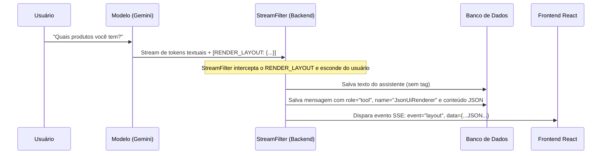

# 🎨 Generative UI - Fase 2: Renderização Dinâmica de Layouts JSON

Este guia explica detalhadamente o funcionamento da segunda fase da nossa Prova de Conceito (PoC) de **Generative UI**. Nesta abordagem, a Inteligência Artificial deixa de apenas preencher componentes rígidos e passa a atuar como a **designer da interface**, decidindo a hierarquia e estilo dos elementos que vão em tela.

---

## 💡 1. Conceito Central (Fase 1 vs Fase 2)

* **Fase 1 (Componentes Estáticos)**: O LLM enviava apenas uma tag curta: `[RENDER_UI: {"component": "ProductCatalog"}]`. O frontend continha o componente rígido `ProductCatalog` e desenhava os dados que recebia da mesma forma para todas as respostas.
* **Fase 2 (Layouts Dinâmicos)**: O LLM chama a ferramenta local, lê os dados obtidos e decide como quer exibi-los. Ela gera uma tag estruturada contendo uma árvore de layout (DSL):
  `[RENDER_LAYOUT: { "type": "grid", "spacing": 2, "children": [...] }]`.
  O frontend atua como um interpretador, renderizando recursivamente os cartões, botões e textos especificados pela IA.

---

## 📐 2. O Mini-DSL de Layout JSON Suportado

Para que o LLM não precise gerar códigos complexos, definimos uma gramática JSON simplificada que mapeia diretamente para os widgets do **Material-UI (MUI v9)**:

### Componentes Disponíveis:
1. **`container` (Mapeia para `Box` com Flexbox)**:
   - Agrupa filhos vertical ou horizontalmente.
   - Propriedades: `orientation` (`"vertical" | "horizontal"`), `spacing` (gap em `rem`).
2. **`text` (Mapeia para `Typography`)**:
   - Renderiza textos com variações tipográficas.
   - Propriedades: `value` (conteúdo), `variant` (`"h5" | "h6" | "subtitle1" | "body2"`), `color` (estilo de cor).
3. **`card` (Mapeia para `Card` + `CardContent` com Hover Premium)**:
   - Cartões de destaque com ícone, título e valor principal.
   - Propriedades: `title`, `value`, `icon` (`"product" | "money" | "history" | "sales" | "trend"`), `chip` (selo pequeno, opcional), `children` (outros nós aninhados, opcional).
4. **`grid` (Mapeia para `Grid` auto-responsivo)**:
   - Alinha os componentes filhos em colunas responsivas.
   - Propriedades: `spacing`, `children`.
5. **`button` (Mapeia para `Button` interativo)**:
   - Botões que disparam ações no frontend.
   - Propriedades: `label`, `action` (ID da ação), `params` (dados associados para passar ao evento).

---

## 🛠️ 3. O Fluxo no Backend

A lógica do backend está concentrada nos arquivos `agents.py` e `routes.py`:



### A. O Agente e as Regras do Prompt (`agents.py`)
Configuramos a LLM em [agents.py](file:///mnt/c0b6217c-c2f3-4c1f-8ba2-c8d177f718a9/development/personal/agent-chat-sse-fastapi-01/agent-service/app/agents.py) com temperatura `0.0` para que ela seja extremamente precisa ao montar o JSON.
O prompt descreve exatamente o formato do DSL acima, e instrui a LLM a **nunca desenhar listas textuais markdown** para dados comerciais. Ela deve rodar a ferramenta respectiva no backend (ex: `list_products`) e, ao obter os dados, transformá-los na tag `[RENDER_LAYOUT: ...]`.

### B. Interceptação reativa (`routes.py` - `StreamFilter`)
O `StreamFilter` em [routes.py](file:///mnt/c0b6217c-c2f3-4c1f-8ba2-c8d177f718a9/development/personal/agent-chat-sse-fastapi-01/agent-service/app/routes.py) lê cada caractere do modelo em tempo real:
1. Ao encontrar `[RENDER_LAYOUT:`, o filtro bloqueia a emissão desses caracteres para a tela do usuário.
2. Ao fechar a tag com `]`, o backend parseia o JSON interno gerado pela LLM.
3. Cria uma mensagem de chat na tabela com `role: "tool"`, `name: "JsonUiRenderer"` e o `content` como a string JSON crua do layout.
4. Envia para o cliente um evento Server-Sent Event (SSE) customizado: `event: "layout"` contendo o payload estruturado.

---

## 🖥️ 4. O Fluxo no Frontend

A leitura e renderização são feitas no hook `useSSEChat.ts` e nos componentes `Chat.tsx` e `JsonUiRenderer.tsx`:

### A. Capturando o Evento (`useSSEChat.ts`)
O hook [useSSEChat.ts](file:///mnt/c0b6217c-c2f3-4c1f-8ba2-c8d177f718a9/development/personal/agent-chat-sse-fastapi-01/frontend/src/hooks/useSSEChat.ts) escuta o evento `layout`. Quando ele é disparado pelo backend, o hook cria um objeto de mensagem normal na lista local com:
- `role: "tool"`
- `name: "JsonUiRenderer"`
- `content: JSON_do_Layout`

### B. Mapeando e Renderizando (`Chat.tsx`)
No componente principal [Chat.tsx](file:///mnt/c0b6217c-c2f3-4c1f-8ba2-c8d177f718a9/development/personal/agent-chat-sse-fastapi-01/frontend/src/components/Chat.tsx), ao percorrer a lista de mensagens do chat, se o papel for `"tool"` e o nome for `"JsonUiRenderer"`, nós renderizamos o interpretador dinâmico:
```tsx
{msg.name === "JsonUiRenderer" ? (
  <JsonUiRenderer data={msg.content} />
) : ... }
```

### C. O Interpretador de Layout (`JsonUiRenderer.tsx`)
O componente [JsonUiRenderer.tsx](file:///mnt/c0b6217c-c2f3-4c1f-8ba2-c8d177f718a9/development/personal/agent-chat-sse-fastapi-01/frontend/src/components/JsonUiRenderer.tsx) recebe o JSON e roda um parser recursivo. Veja o esqueleto conceitual:

```tsx
function renderNode(node: LayoutNode, index: number) {
  switch (node.type) {
    case "container":
      return (
        <Box sx={{ flexDirection: node.orientation === "horizontal" ? "row" : "column", gap: node.spacing }}>
          {node.children?.map((child, idx) => renderNode(child, idx))}
        </Box>
      );
    case "text":
      return <Typography variant={node.variant}>{node.value}</Typography>;
    case "card":
      return (
        <Card>
          <CardContent>
            {/* Desenha título, valor e ícone (ShoppingBagIcon, AttachMoneyIcon, etc) */}
            {node.children?.map((child, idx) => renderNode(child, idx))}
          </CardContent>
        </Card>
      );
    case "grid":
      return (
        <Grid container spacing={node.spacing}>
          {node.children?.map((child, idx) => (
            <Grid size={{ xs: 12, sm: 6 }} key={idx}>
              {renderNode(child, idx)}
            </Grid>
          ))}
        </Grid>
      );
    case "button":
      return (
        <Button onClick={() => triggerAction(node.label, node.action, node.params)}>
          {node.label}
        </Button>
      );
  }
}
```

#### Integração de Ações (Simulação de Compra)
Quando a IA gera um botão:
```json
{
  "type": "button",
  "label": "Simular Compra",
  "action": "purchase",
  "params": { "id": 1, "name": "Laptop Pro" }
}
```
O componente React renderiza um botão MUI. Ao ser clicado, ele dispara a função `triggerAction()`, que exibe um alerta premium temporário na tela: *"Ação executada: Simular Compra com parâmetros: ..."*, simulando perfeitamente a integração de negócios no frontend!

---

## 💾 5. Por que o Histórico Funciona Automaticamente?

Como a resposta do layout é persistida diretamente na tabela `chat_messages` com a role `"tool"` e o nome `"JsonUiRenderer"`, quando você atualiza a página ou clica em uma conversa anterior na barra lateral:
1. O backend lê as mensagens diretamente do banco através do endpoint `/threads/{thread_id}/messages` e as retorna prontas.
2. O frontend carrega as mensagens e vê que existe uma mensagem com a role `"tool"` e o nome `"JsonUiRenderer"`.
3. O frontend passa o JSON para o `<JsonUiRenderer data={msg.content} />` que desenha a interface instantaneamente.

Isso significa que **toda a estrutura visual e os dados são carregados do banco de dados**, garantindo que a conversa do histórico seja exatamente idêntica à conversa gerada em tempo real!
