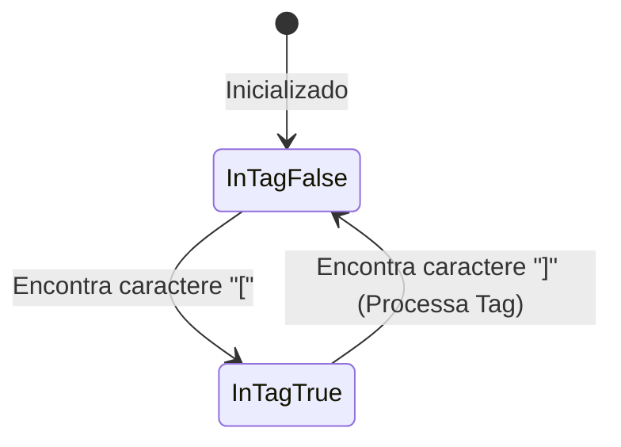

# 📑 Explicação Detalhada da Classe `StreamFilter`

Este documento explica de forma técnica e didática o funcionamento da classe `StreamFilter` em [routes.py](file:///mnt/c0b6217c-c2f3-4c1f-8ba2-c8d177f718a9/development/personal/agent-chat-sse-fastapi-01/agent-service/app/routes.py). Ele foi criado para que você possa apresentar o conceito e a implementação para outros desenvolvedores.

---

## 🎯 1. O Problema que ela Resolve

Quando trabalhamos com modelos de linguagem (LLMs) em produção, geralmente usamos **streaming** via Server-Sent Events (SSE) para que a resposta seja exibida caractere a caractere no frontend, diminuindo a percepção de latência para o usuário.

Para implementar **Generative UI**, o LLM precisa de uma forma de comandar o frontend a renderizar um componente (como um catálogo de produtos ou um gráfico). No nosso design, instruímos a LLM no prompt do sistema a gerar uma tag especial no meio de sua resposta de texto:
```text
Aqui está o catálogo de itens: [RENDER_UI: {"component": "ProductCatalog"}]
```

Se enviássemos essa stream diretamente ao frontend:
1. O usuário veria a tag `[RENDER_UI: ...]` aparecendo feia e incompleta no balão de conversa enquanto ela estivesse sendo gerada.
2. O parser de Markdown do frontend falharia ao tentar interpretar esse JSON cru de forma amigável.

### Por que um Regex simples não funciona?
Como a stream envia pedaços muito pequenos de texto (ex: `["[RE", "NDER", "_UI:", ...]`), **não podemos rodar expressões regulares em cada chunk isolado**, pois a tag estará quebrada no meio de múltiplos pacotes de rede.

A solução é usar um **parser de streaming baseado em estado** que acumula texto em um buffer local, detecta a tag em tempo real, oculta-a do usuário, hidrata-a com dados reais do banco de dados e a entrega como um evento estruturado.

---

## ⚙️ 2. Arquitetura e Estados do Parser

O `StreamFilter` funciona como uma **máquina de estados finita** simples com dois estados de leitura de buffer:
* **Estado Texto Comum (`in_tag = False`)**: Repassa o texto diretamente para exibição.
* **Estado Captura de Tag (`in_tag = True`)**: Intercepta e esconde o texto para avaliar se é uma tag JSON de renderização.



---

## 💻 3. Análise Linha por Linha do Código

Abaixo está o código do parser com explicações de cada trecho:

```python
class StreamFilter:
    def __init__(self):
        # Buffer acumulador de caracteres da stream
        self.buffer = ""
        # Flag que indica se estamos atualmente lendo dentro de colchetes "[ ... ]"
        self.in_tag = False
```
* **`self.buffer`**: String que guarda os caracteres que ainda não foram processados ou liberados.
* **`self.in_tag`**: Determina se estamos acumulando caracteres com a suspeita de ser uma tag de componente.

### O Método `feed`
Este método é executado para cada chunk de tokens que chega do LLM:

```python
    def feed(self, chunk: str) -> list[tuple[str, str]]:
        # 1. Adiciona o novo pedaço de texto ao nosso buffer acumulador
        self.buffer += chunk
        events = []

        # 2. Loop de processamento do buffer acumulado
        while True:
            if not self.in_tag:
                # ==========================================
                # ESTADO: Procurando o início de uma tag "["
                # ==========================================
                idx = self.buffer.find("[")
                if idx == -1:
                    # Não há nenhuma abertura "[". Todo o buffer atual é texto normal.
                    text_to_yield = self.buffer
                    self.buffer = ""
                    if text_to_yield:
                        events.append(("message", text_to_yield))
                    break
                else:
                    # Encontrou "[". Tudo antes de "[" é texto normal a ser liberado imediatamente.
                    text_to_yield = self.buffer[:idx]
                    # O buffer agora começa a partir do "["
                    self.buffer = self.buffer[idx:]
                    self.in_tag = True
                    if text_to_yield:
                        events.append(("message", text_to_yield))
```
* **Linha `idx = self.buffer.find("[")`**: Procuramos a abertura de colchetes.
* **Se `idx == -1`**: Liberamos tudo como mensagem comum (`message`) e limpamos o buffer.
* **Se encontrar `[`**: Cortamos o texto anterior e o enviamos. O buffer é atualizado para começar com `[` e entramos no modo de captura (`in_tag = True`).

```python
            else:
                # ==========================================
                # ESTADO: Procurando o fechamento da tag "]"
                # ==========================================
                idx = self.buffer.find("]")
                if idx == -1:
                    # A tag começou com "[", mas o caractere "]" ainda não chegou na stream.
                    # Mantemos os dados no buffer e interrompemos o loop para esperar o próximo feed.
                    break
                else:
                    # Encontrou o fechamento "]". Extraímos a tag inteira.
                    full_tag = self.buffer[:idx + 1]
                    # Removemos a tag do buffer para processar o restante do texto
                    self.buffer = self.buffer[idx + 1:]
                    self.in_tag = False

                    # Verifica se a tag de fato é o nosso comando de Generative UI
                    if full_tag.startswith("[RENDER_UI:"):
                        try:
                            # Corta a string para extrair apenas o JSON (remove "[RENDER_UI:" e "]")
                            json_str = full_tag[11:-1].strip()
                            tag_data = json.loads(json_str)
                            comp_name = tag_data.get("component")
                            args = tag_data.get("args", {})

                            # ==========================================
                            # HIDRATAÇÃO DINÂMICA DE DADOS
                            # ==========================================
                            hydrated_data = None
                            if comp_name == "ProductCatalog":
                                from app.tools import PRODUCTS
                                hydrated_data = PRODUCTS
                            elif comp_name == "SalesDashboard":
                                from app.tools import SALES_HISTORY
                                t = args.get("type", "summary")
                                if t == "summary":
                                    total = sum(sale["total_value"] for sale in SALES_HISTORY)
                                    hydrated_data = {
                                        "total_revenue": total,
                                        "total_sales_count": len(SALES_HISTORY),
                                    }
                                else:
                                    hydrated_data = SALES_HISTORY

                            # Prepara o payload final contendo o nome do componente e dados reais do banco
                            payload = {
                                "component": comp_name,
                                "data": hydrated_data,
                            }
                            # Retorna o evento do tipo "component" que o frontend escuta
                            events.append(("component", json.dumps(payload)))
                        except Exception as e:
                            logger.error(f"Erro ao processar RENDER_UI tag: {e}")
                    else:
                        # Se não era a nossa tag (ex: colchetes normais de Markdown "[meu link]"),
                        # nós a devolvemos para a tela do usuário como mensagem de texto comum.
                        events.append(("message", full_tag))
        return events
```
* **Tratamento de colchetes normais**: Se a tag extraída for apenas um link markdown (`[meu link]`), ela cai no `else` e é reemitida como texto normal. Isso garante que o parser **não quebre** a formatação Markdown padrão!
* **Hidratação de Dados**: É aqui que ocorre a mágica. O LLM gerou apenas `[RENDER_UI: {"component": "ProductCatalog"}]`. A classe intercepta essa chamada leve e anexa o array completo de produtos (com fotos mockadas, preços e IDs) no payload que será enviado ao frontend. Isso reduz o custo de geração de tokens e previne truncamento de texto na IA.

---

## 🔄 4. O Fluxo de Integração em tempo real

No arquivo `routes.py`, durante a stream de tokens:

```python
async for event in agent.astream_events(inputs, config=config, version="v2"):
    if kind == "on_chat_model_stream":
        chunk = event.get("data", {}).get("chunk")
        if chunk and hasattr(chunk, "content") and chunk.content:
            # Alimentamos o filtro com cada token do modelo
            for event_type, data in stream_filter.feed(chunk.content):
                if event_type == "message":
                    # Somente o texto normal acumula para salvar no banco
                    assistant_content += data
                elif event_type == "component":
                    # Salva no banco de dados como mensagem de componente (role="tool")
                    comp_payload = json.loads(data)
                    await crud.create_chat_message(
                        db,
                        db_schemas.MessageCreate(
                            id=str(uuid4()),
                            thread_id=payload.thread_id,
                            role="tool",
                            name=comp_payload["component"],
                            content=json.dumps(comp_payload["data"]),
                        ),
                    )
                # Envia o evento SSE para o frontend em tempo real
                yield ServerSentEvent(raw_data=data, event=event_type)
```

### Vantagens dessa Solução
1. **Performance**: A LLM gera apenas ~30 tokens de comando para renderizar uma interface complexa de 1000 tokens de dados brutos.
2. **Resiliência**: Se a conexão de rede oscilar ou o JSON gerado for inválido, o texto principal de conversação do assistente continua sendo salvo perfeitamente no banco de dados.
3. **Persistência Limpa**: O histórico de conversas armazena a mensagem de renderização com a role `"tool"` e o JSON do componente, tornando o carregamento histórico instantâneo e idêntico ao tempo real.
